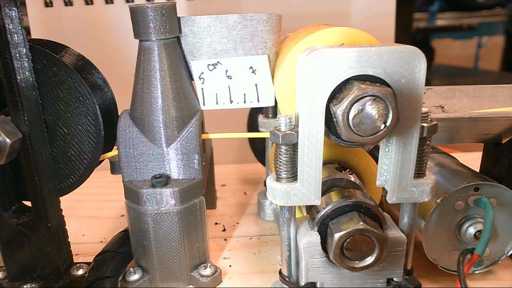

# MOST Filament Diameter Sensor

 >*A camera-based filament diameter sensor for RecycleBot*
  

   
**Figure 1.** Source image
    

The goal is to measure the diameter distribution of the output filament. This example is shown for one image only. But in real use, this algorithm can be repeated in a cycle to get not only an instantaneous value for the diameter, but also the diameter distribution over multiple measurements.   

### Dependencies
* [opencv](https://pypi.org/project/opencv-python/)
* [skimage](https://pypi.org/project/skimage/)
* [numpy](https://pypi.org/project/numpy/)
* [matplotlib](https://pypi.org/project/matplotlib/)
* [seaborn](https://pypi.org/project/seaborn/)

### Step by step tutorial
For the full tutorial please see a [jupyter notebook](recyclebot.ipynb) or an uploaded [pdf file](recyclebot.pdf). A pure Python code is located [here](recyclebot.py).   
